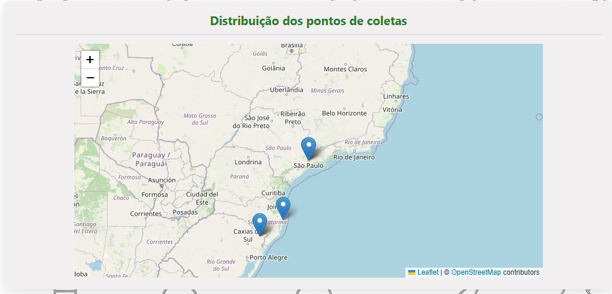
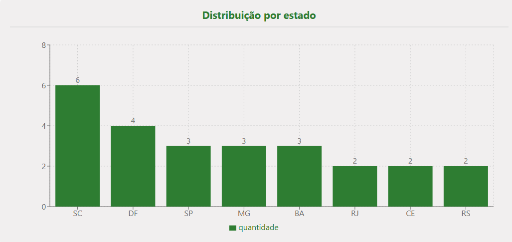
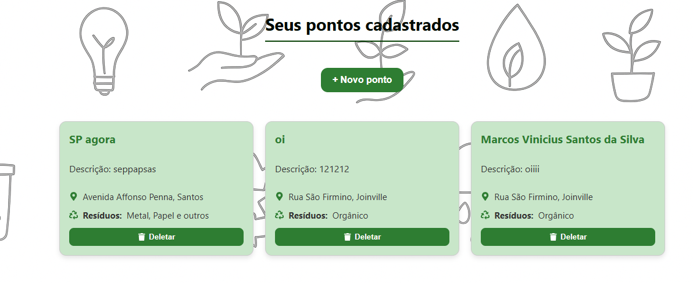
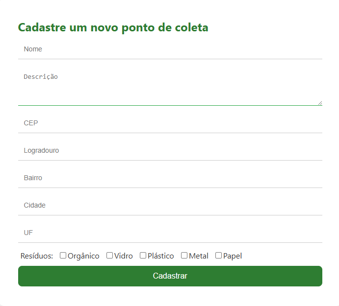

# EcoPonto365


## Sobre o Projeto

**EcoPonto365** é uma plataforma web desenvolvida para facilitar o gerenciamento e a localização de pontos de coleta de resíduos recicláveis. O sistema conecta cidadãos, empresas e órgãos públicos, promovendo o descarte correto de resíduos e incentivando práticas sustentáveis.

---

## Problema que Resolve

O descarte inadequado de resíduos é um dos grandes desafios ambientais das cidades. Muitas pessoas não sabem onde descartar corretamente materiais recicláveis, e gestores públicos têm dificuldade em mapear e divulgar pontos de coleta.  
**EcoPonto365** resolve esse problema ao:

- Permitir o cadastro e a divulgação de pontos de coleta.
- Exibir esses pontos em um mapa interativo.
- Oferecer estatísticas sobre a distribuição dos pontos por estado.
- Facilitar o acesso à informação para toda a comunidade.

---

## Tecnologias e Técnicas Utilizadas

- **Frontend:**  
  - [React](https://react.dev/) (com Vite)
  - [React Router](https://reactrouter.com/) (navegação SPA)
  - [React Leaflet](https://react-leaflet.js.org/) (mapas interativos)
  - [React Icons](https://react-icons.github.io/react-icons/) (ícones)
  - [React Toastify](https://fkhadra.github.io/react-toastify/) (notificações)
  - CSS Modules (componentização de estilos)

- **Backend:**  
  - API REST (Node.js/Express ou similar, não incluso neste repositório)

- **Técnicas:**  
  - Componentização e reutilização de código
  - Consumo de APIs REST
  - Validação de formulários
  - Feedback visual ao usuário (notificações)
  - Responsividade

---

## Imagem do Sistema

<div align="center">
  
  <br>
  
  
</div>


---

## Como Executar

1. **Clone o repositório:**
   ```
   git clone https://github.com/seu-usuario/ecoponto365.git
   cd ecoponto365
   ```

2. **Instale as dependências:**
   ```
   npm install
   ```

3. **Inicie o frontend:**
   ```
   npm run dev
   ```

4. **Backend:**  
   Certifique-se de que a API backend está rodando em `http://localhost:3000`.

5. **Acesse:**  
   Abra [http://localhost:5173](http://localhost:5173) no navegador.

---

## Funcionalidades

- **Cadastro de Usuário:**  
  Crie sua conta para acessar o sistema.

- **Login:**  
  Acesse com seu e-mail e senha.

- **Cadastro de Pontos de Coleta:**  
  Informe nome, descrição, endereço (com busca automática pelo CEP), resíduos aceitos e localização geográfica.

- **Visualização em Mapa:**  
  Veja todos os pontos cadastrados em um mapa interativo.

- **Estatísticas:**  
  Acompanhe a distribuição dos pontos de coleta por estado em gráficos.

- **Gerenciamento de Pontos:**  
  Visualize e exclua pontos de coleta cadastrados.

---

## Possíveis Melhorias

- **Edição de pontos de coleta**
- **Upload de fotos dos pontos**
- **Filtro por tipo de resíduo no mapa**
- **Integração com APIs públicas de coleta**
- **Sistema de avaliação dos pontos**
- **Dashboard administrativo**
- **Internacionalização (i18n)**
- **Progressive Web App (PWA)**

---


## Licença

Projeto desenvolvido por mim!

---

**EcoPonto365** — Conectando pessoas e sustentabilidade, todos os dias! ♻️🌱
